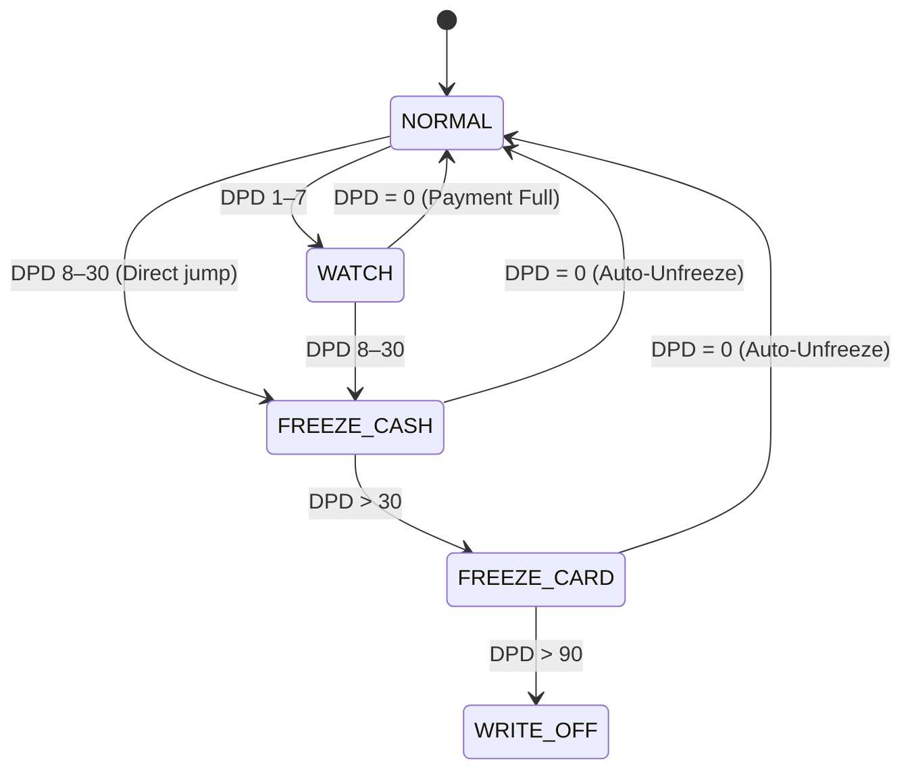
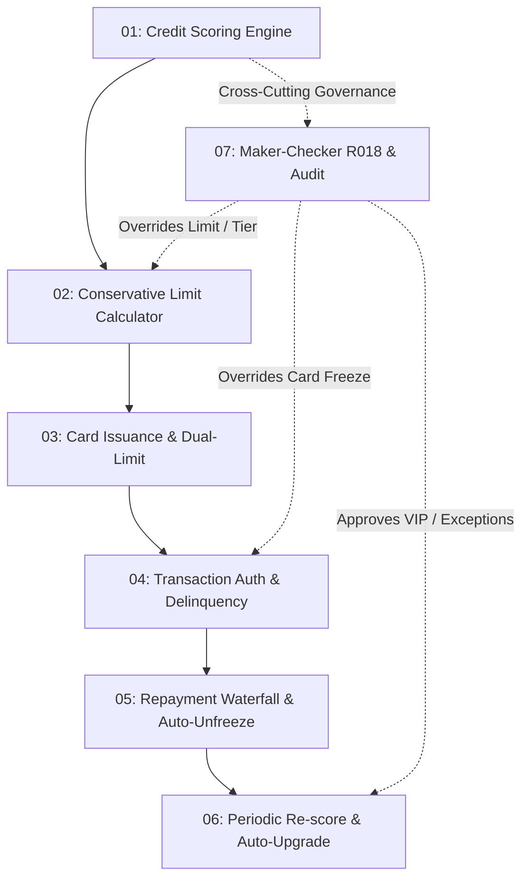

# 00: INSEE Membership Card Engine & Risk Architecture (Central Contract)

## Overview & System Boundaries
This document defines the **Central Architectural Contract** for the INSEE Membership Card Engine and Risk Decision System across all 7 implementation tickets (`01` through `07`). Every domain service, schema migration, API payload, and integration test must strictly adhere to the definitions, formulas, state machines, and concurrency invariants outlined herein.

---

## 1. Domain Glossary & Terminology Standards

| Term | Canonical Representation | Description |
| :--- | :--- | :--- |
| **Credit Account** | `credit_accounts` | The central revolving line account belonging to a customer. Contains the single master credit limit and total ledger balance. |
| **Member Card** | `member_cards` | The physical/virtual card instrument bound to a credit account and a customer. Holds card lifecycle state and DPD delinquency status. |
| **Risk Grade** | `RiskGrade` enum | Credit rating calculated from 1,000 pts credit score: `A1`, `A2`, `A3`, `B1`, `B2`, `C1`, `C2`, `D`. |
| **Tier** | `MembershipTier` enum | Customer membership tier level: `SILVER`, `GOLD`, `PLATINUM`, `DIAMOND`, `VIP`. |
| **Cash Limit** | `cash_limit` | The sub-limit allocated specifically for cash withdrawals (strictly 20% of `credit_limit` by default). |
| **Purchase Limit** | `purchase_limit` | The sub-limit allocated for retail merchant purchases (strictly 80% of `credit_limit` by default). |
| **Single Ledger Invariant** | Total Balance Invariant | Dual limits share a single underlying balance liability: `total_utilized_amount = cash_utilized_amount + purchase_utilized_amount <= credit_limit`. |
| **DPD (Days Past Due)** | `days_past_due` | Count of days elapsed since the oldest unpaid minimum due billing date. Drives the delinquency risk state machine. |
| **Delinquency State** | `delinquency_state` | `NORMAL` (0), `WATCH` (1–7), `FREEZE_CASH` (8–30), `FREEZE_CARD` (>30), `WRITE_OFF` (>90). |
| **Maker-Checker** | Privileged Governance | Two-person policy control enforcing that an override request must be created by an officer (Maker) and approved by a distinct manager (Checker). |

---

## 2. Core Mathematical Invariants

### 2.1 Credit Score Model (1,000 Points)
$$Score_{total} = \sum_{i=1}^{8} S_i \in [0, 1000]$$

| Dimension | Max Points | Weight |
| :--- | :--- | :--- |
| 1. Income & Employment Stability | 200 pts | 20% |
| 2. CIB Repayment History & Delinquency | 200 pts | 20% |
| 3. Current Debt-to-Income (DTI) & Leverage | 150 pts | 15% |
| 4. Residential & Collateral Stability | 100 pts | 10% |
| 5. Internal INSEE Payment Track Record | 150 pts | 15% |
| 6. Behavioral & Transaction Velocity | 80 pts | 8% |
| 7. Demographic & Dependency Burden | 60 pts | 6% |
| 8. Emergency Liquidity & Savings Buffer | 60 pts | 6% |

**Threshold Rule:**
* $Score_{total} \ge 550$: Eligible for approval.
* $Score_{total} < 550$: Automatic Hard Decline (`DECLINED_SCORE_BELOW_MINIMUM`).

### 2.2 Conservative Credit Limit Calculation (The MIN Rule)
$$ApprovedLimit = \min(L_{requested}, L_{tier\_cap}, L_{capacity}, L_{risk}, L_{reg\_cap})$$

Where:
* $L_{requested}$: Customer requested amount.
* $L_{tier\_cap}$: Ceiling determined by Membership Tier (Day 1 is capped at Silver: 5,000,000 LAK).
* $L_{capacity} = \frac{MonthlyIncome \times DTI_{max} - ExistingDebtService}{MonthlyAnnuityFactor(r, n)}$
* $L_{risk}$: Risk-grade ceiling matrix based on evaluated Risk Grade.
* $L_{reg\_cap}$: Statutory microfinance limit ceiling (100,000,000 LAK).

### 2.3 Dual-Limit Sub-allocation Invariant
$$\text{credit\_limit} = \text{cash\_limit} + \text{purchase\_limit}$$
$$\text{cash\_limit} = \lfloor \text{credit\_limit} \times 0.20 \rfloor$$
$$\text{purchase\_limit} = \text{credit\_limit} - \text{cash\_limit}$$

Availability Rules:
* $\text{cash\_available} = \min(\text{cash\_limit} - \text{cash\_utilized}, \text{credit\_limit} - \text{total\_utilized})$
* $\text{purchase\_available} = \min(\text{purchase\_limit} - \text{purchase\_utilized}, \text{credit\_limit} - \text{total\_utilized})$

---

## 3. Delinquency State Machine Contract

| State | DPD Range | Purchase Allowed? | Cash Withdrawal Allowed? | Limit Increase Eligible? |
| :--- | :--- | :--- | :--- | :--- |
| `NORMAL` | 0 | Yes | Yes | Yes (if cycle met) |
| `WATCH` | 1–7 | Yes | Yes | **No** (Suspended) |
| `FREEZE_CASH` | 8–30 | Yes | **No** (Blocked HTTP 403) | **No** (Suspended) |
| `FREEZE_CARD` | 31–90 | **No** (Blocked HTTP 403) | **No** (Blocked HTTP 403) | **No** (Suspended) |
| `WRITE_OFF` | > 90 | **No** | **No** | **No** |

---

## 4. Repayment Waterfall Priority Order

When a repayment amount $P$ is received, funds must be allocated in the following strict waterfall sequence:
1. **Late Fees & Penalty Charges** (Overdue fee, dishonor fees)
2. **Accrued Cash Advance Interest** (Highest interest rate: e.g. 28% APR)
3. **Cash Advance Principal** (`cash_utilized_amount` decreased)
4. **Accrued Retail Purchase Interest** (Standard interest rate: e.g. 18% APR)
5. **Retail Purchase Principal** (`purchase_utilized_amount` decreased)
6. **Unbilled Fees / Excess Balance** (Refund / Prepaid credit)

---

## 5. Concurrency & Ledger Consistency Standard
1. **Pessimistic Locking (`SELECT ... FOR UPDATE`):**
   * Any balance mutation (authorization, settlement, repayment, reversal) must acquire an exclusive row lock on `credit_accounts` and `member_cards` within an active database transaction.
2. **Idempotency Keys:**
   * All mutating financial endpoints must require an `Idempotency-Key` header (UUIDv4) stored in `idempotency_records` table with a 24-hour TTL and payload hash.
3. **Double-entry Audit Ledger:**
   * Direct updates to `utilized_amount` without a corresponding `credit_ledgers` row are strictly prohibited. Every balance delta must record:
     * `entry_type`: `DEBIT` / `CREDIT`
     * `bucket`: `CASH` / `PURCHASE` / `FEE` / `INTEREST`
     * `balance_before` and `balance_after`

---

## 6. Dependency Graph & Sequencing

