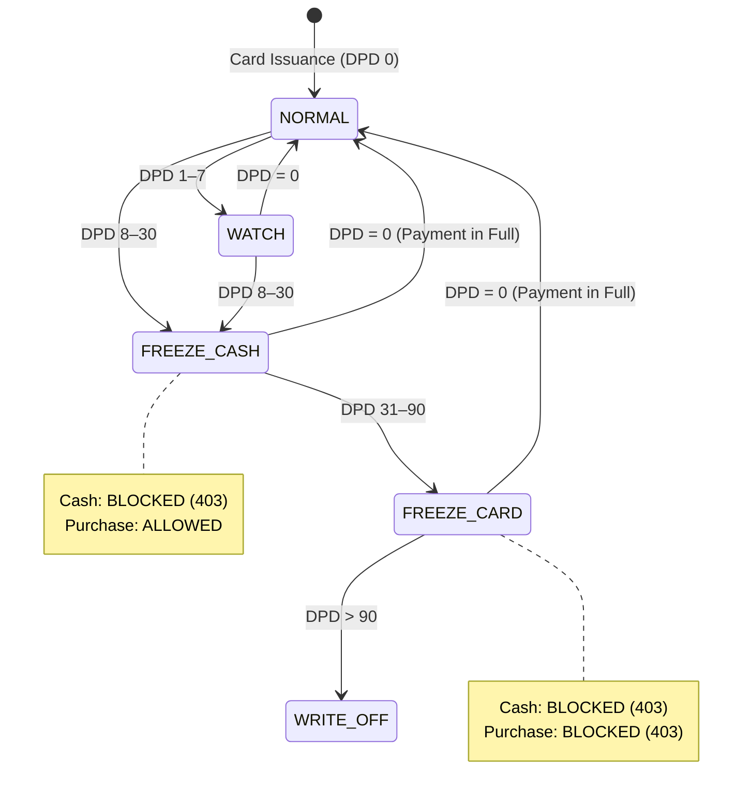

# 04: Dual-Limit Transaction Authorization & Delinquency State Machine Enforcement

## Context
As emphasized in [ADR 0003](file:///Users/inseemicrofinance02/loan_system/docs/adr/0003-insee-membership-card-engine-and-risk-architecture.md), transaction authorization is a high-sensitivity core component of the revolving card system. The engine must govern dual-limit authorizations (differentiating cash withdrawals from retail merchant purchases) while strictly enforcing risk controls driven by Days Past Due (DPD). Crucially, during early-stage default (DPD 8–30), the policy mandates **asymmetric risk control**: Cash advances are frozen immediately to stop cash bleed, whereas retail purchase functionality remains active to preserve customer utility and merchant partnerships.

## Objective
Build the real-time Transaction Authorization Service and Delinquency State Machine engine. This service enforces available balance checks against the appropriate limit bucket (Cash vs Purchase), executes atomic ledger balance mutations with pessimistic locking, and evaluates DPD transitions (`NORMAL`, `WATCH`, `FREEZE_CASH`, `FREEZE_CARD`, `WRITE_OFF`).

## Business Rules
1. **Transaction Bucket Categorization:**
   * `TRANSACTION_TYPE = 'PURCHASE'`:
     * Must have `amount <= purchase_available_amount`.
     * Draws from `purchase_utilized_amount` and `total_utilized_amount`.
     * Permitted under `NORMAL`, `WATCH`, and `FREEZE_CASH` states.
     * Blocked under `FREEZE_CARD` and `WRITE_OFF`.
   * `TRANSACTION_TYPE = 'CASH_WITHDRAWAL'`:
     * Must have `amount <= cash_available_amount`.
     * Draws from `cash_utilized_amount` and `total_utilized_amount`.
     * Permitted strictly under `NORMAL` and `WATCH` states.
     * **Strictly Blocked** under `FREEZE_CASH`, `FREEZE_CARD`, and `WRITE_OFF`.
2. **Delinquency State Machine Rules:**
   * **DPD = 0 (`NORMAL`):** All transactions permitted; eligible for auto-upgrade cycles.
   * **DPD 1–7 (`WATCH`):** All transactions permitted; limit increase requests are **suspended**.
   * **DPD 8–30 (`FREEZE_CASH`):**
     * Cash advances: **REJECTED (403 Forbidden)** with code `CASH_LIMIT_FROZEN_DELINQUENT`.
     * Retail purchases: **APPROVED** if purchase limit is available.
     * Limit increase requests: **SUSPENDED**.
   * **DPD 31–90 (`FREEZE_CARD`):**
     * All transactions (Purchase & Cash): **REJECTED (403 Forbidden)** with code `CARD_FROZEN_OVERDUE`.
     * Inbound repayments remain accepted.
   * **DPD > 90 (`WRITE_OFF`):** Account permanently blocked, designated for collections/legal recovery.
3. **Double-Entry Ledger Integrity:**
   * No balance mutation may occur without a corresponding immutable row inserted into `credit_ledgers`.
   * `balance_before` + `delta` must exactly equal `balance_after`.

## State Machine Diagram


## Scope
* **In Scope:**
  * Real-time authorization API (`POST /api/v1/cards/:cardId/authorize`).
  * DPD state transition engine (`POST /api/v1/cards/:cardId/dpd/evaluate`).
  * Atomic balance updates with pessimistic row-locking (`SELECT ... FOR UPDATE`).
  * Double-entry immutable ledger logging (`credit_ledgers`).
  * Full integration tests testing concurrency and state machine enforcement.
* **Out of Scope:**
  * Repayment processing and waterfall clearing (handled in Ticket 05).
  * Manual override of frozen cards (governed via Ticket 07).

## Database / Schema
Enhance or verify tables:
* `member_cards`:
  * `delinquency_state`: ENUM('NORMAL','WATCH','FREEZE_CASH','FREEZE_CARD','WRITE_OFF') NOT NULL DEFAULT 'NORMAL'
  * `dpd`: INT NOT NULL DEFAULT 0
  * `last_dpd_evaluated_at`: DATETIME NULL
* `credit_ledgers`:
  * `id`: BIGINT PK AUTO_INCREMENT
  * `credit_account_id`: BIGINT NOT NULL
  * `card_id`: BIGINT NOT NULL
  * `transaction_ref`: VARCHAR(64) UNIQUE NOT NULL
  * `entry_type`: ENUM('DEBIT','CREDIT') NOT NULL
  * `bucket`: ENUM('CASH','PURCHASE','FEE','INTEREST') NOT NULL
  * `amount`: DECIMAL(15,2) NOT NULL
  * `balance_before`: DECIMAL(15,2) NOT NULL
  * `balance_after`: DECIMAL(15,2) NOT NULL
  * `created_at`: DATETIME NOT NULL
* `idempotency_records`:
  * `idempotency_key`: VARCHAR(64) PK
  * `endpoint`: VARCHAR(128) NOT NULL
  * `request_hash`: VARCHAR(64) NOT NULL
  * `response_body`: JSON NOT NULL
  * `created_at`: DATETIME NOT NULL

## Domain Service
* **Service Class:** `CardTransactionAuthorizationService` (`src/services/card-transaction-authorization.service.ts`)
  * `authorizeTransaction(cardId: number, dto: AuthorizeTransactionDto): Promise<AuthorizationResult>`
  * `evaluateDelinquencyState(cardId: number, currentDpd: number): Promise<DelinquencyTransitionResult>`
  * `assertTransactionAllowed(card: MemberCard, type: TransactionType, amount: number): void`

## API Contract
* **Endpoint:** `POST /api/v1/cards/:cardId/authorize`
* **Headers:** `Idempotency-Key: <UUIDv4>`, `Content-Type: application/json`
* **Request Body:**
```json
{
  "transactionRef": "TX-20260925-0091",
  "transactionType": "PURCHASE",
  "amountLak": 1500000,
  "merchantId": "MERCH-HOMEPRO-01",
  "description": "Building materials purchase"
}
```
* **Success Response (200 OK):**
```json
{
  "success": true,
  "data": {
    "authorizationCode": "AUTH-778899",
    "cardId": 808,
    "status": "APPROVED",
    "transactionType": "PURCHASE",
    "authorizedAmount": 1500000,
    "remainingAvailable": {
      "totalAvailable": 2300000,
      "cashAvailable": 600000,
      "purchaseAvailable": 1700000
    },
    "authorizedAt": "2026-09-25T14:30:00.000Z"
  }
}
```

* **Declined Response - Cash Frozen (403 Forbidden):**
```json
{
  "success": false,
  "error": {
    "code": "CASH_LIMIT_FROZEN_DELINQUENT",
    "message": "Cash withdrawal suspended due to account delinquency (DPD 14). Retail purchases remain active.",
    "delinquencyState": "FREEZE_CASH",
    "currentDpd": 14
  }
}
```

* **Declined Response - Insufficient Bucket Limit (422 Unprocessable):**
```json
{
  "success": false,
  "error": {
    "code": "INSUFFICIENT_SUB_LIMIT",
    "message": "Requested cash withdrawal (800,000 LAK) exceeds available cash limit (600,000 LAK).",
    "availableCashLimit": 600000
  }
}
```

## Validation Rules
* `amountLak` must be positive integer (> 0).
* `transactionType` must be either `PURCHASE` or `CASH_WITHDRAWAL`.
* `transactionRef` must be globally unique.

## Error Cases
* `CARD_NOT_ACTIVE` (403): Card status is not `ACTIVE`.
* `CARD_FROZEN_OVERDUE` (403): Card is in `FREEZE_CARD` or `WRITE_OFF` state.
* `CASH_LIMIT_FROZEN_DELINQUENT` (403): Cash advance attempted while in `FREEZE_CASH`.
* `INSUFFICIENT_CREDIT_LIMIT` (422): Aggregate account limit exceeded.
* `INSUFFICIENT_SUB_LIMIT` (422): Bucket-specific limit exceeded.

## Idempotency
* Re-transmitting an authorization request with an existing `Idempotency-Key` or `transactionRef` returns the stored original authorization result without double-debiting balances.

## Concurrency Rules
* **Strict Pessimistic Locking:** `credit_accounts` and `member_cards` rows must be queried using `SELECT ... FOR UPDATE` inside a database transaction.
* Prevents race conditions during concurrent high-frequency authorizations against the same credit line.

## Audit Requirements
* Every approved authorization creates an immutable `credit_ledgers` entry with `balance_before` and `balance_after`.
* State transitions emit `DELINQUENCY_STATE_CHANGED` events with previous and new states, DPD, and timestamp.

## Integration Tests
* `test_authorize_purchase_success`: Normal state, within limit, balances debit correctly.
* `test_authorize_cash_success`: Normal state, within 20% limit, balances debit correctly.
* `test_authorize_cash_exceeds_sublimit`: Request cash advance higher than cash limit but lower than total limit -> Rejected with `INSUFFICIENT_SUB_LIMIT`.
* `test_freeze_cash_differential_blocking`: Set card to DPD 15 (`FREEZE_CASH`). Attempt cash withdrawal -> Rejected 403. Attempt retail purchase within limit -> Approved 200.
* `test_freeze_card_blocks_all`: Set card to DPD 35 (`FREEZE_CARD`). Attempt purchase -> Rejected 403. Attempt cash -> Rejected 403.
* `test_concurrent_authorization_race_condition`: Execute 5 parallel requests each for 1,000,000 LAK against a 3,000,000 LAK limit. Verify exactly 3 succeed and 2 fail, with no negative balance.

## Acceptance Criteria
- [ ] Dual-limit bucket validation strictly enforced for Purchase vs Cash.
- [ ] DPD Delinquency state transitions trigger correctly across all thresholds (0, 1–7, 8–30, 31–90, >90).
- [ ] Differential blocking verified: `FREEZE_CASH` permits retail purchases while blocking cash.
- [ ] `FREEZE_CARD` blocks all card transactions.
- [ ] Pessimistic locking prevents concurrency over-utilization.
- [ ] Double-entry ledger invariant preserved on every mutation.

## Dependencies
* **Blocked by:** Ticket 03 (`03-membership-card-dual-limit.md`).
* **Blocks:** Ticket 05 (`05-repayment-waterfall.md`).
* **Cross-cutting Governance:** Overridden via Ticket 07 (`07-maker-checker-r018.md`) for emergency unfreeze overrides.

## Definition of Done
* Domain service, controller, and routes fully implemented with clean TypeScript types.
* Database transactions with row-level locking tested under concurrent conditions.
* 100% of integration test scenarios pass.
