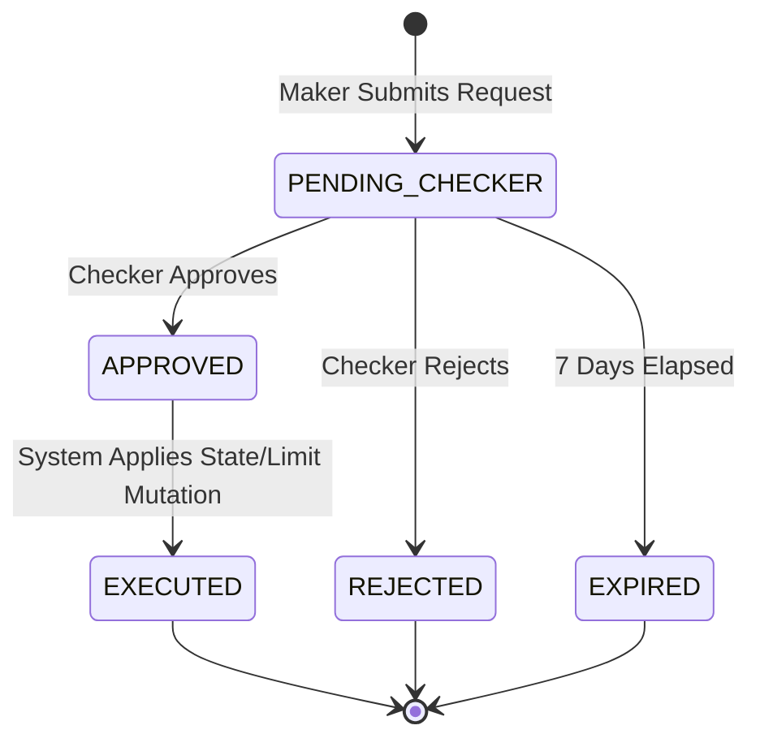

# 07: Maker-Checker Manual Override & Audit Governance (Rule R018)

## Context
In regulated financial institutions and microfinance lending, no single officer should possess unilateral authority to bypass risk underwriting policies. Under [ADR 0003](file:///Users/inseemicrofinance02/loan_system/docs/adr/0003-insee-membership-card-engine-and-risk-architecture.md) and **Policy Rule R018**, all privileged manual exceptions—such as overriding Day-1 Silver tier caps ([Ticket 02](file:///Users/inseemicrofinance02/loan_system/.scratch/insee-membership-card/issues/02-conservative-limit-calculator.md)), granting emergency unfreezes for delinquent cards ([Ticket 04](file:///Users/inseemicrofinance02/loan_system/.scratch/insee-membership-card/issues/04-transaction-authorization-dpd.md)), or approving VIP / Black tier committee escalations ([Ticket 06](file:///Users/inseemicrofinance02/loan_system/.scratch/insee-membership-card/issues/06-periodic-rescoring-auto-upgrade.md))—must pass through an enforced **Maker-Checker Two-Person Governance Control** with mandatory structured reason codes and an immutable audit trail.

## Objective
Implement a cross-cutting Maker-Checker Governance Service and Audit Engine. The service allows authorized loan officers (Makers) to create structured exception requests, mandates independent review and approval by authorized credit supervisors/committee members (Checkers), executes the approved state/limit mutation atomically, and records an unalterable audit log.

## Business Rules
1. **Maker-Checker Segregation of Duties Invariant:**
   * The **Maker** (the user proposing the override) and the **Checker** (the user approving or rejecting the override) **MUST BE DISTINCT USERS** ($\text{maker\_id} \neq \text{checker\_id}$).
   * Self-approval is strictly forbidden and must be rejected with HTTP 403 `FORBIDDEN_SELF_APPROVAL`.
2. **Role & Permission Requirements:**
   * **Maker Roles:** Loan Officer, Senior Underwriter, Risk Analyst.
   * **Checker Roles:** Credit Manager, Branch Manager, Credit Committee Member, Chief Risk Officer.
3. **Supported Override Types (Rule R018):**
   * `LIMIT_BUMP_OVERRIDE`: Allows setting a credit limit exceeding the standard calculated constraint (applicable to Ticket 02).
   * `DAY1_TIER_OVERRIDE`: Allows initiating a new applicant into Gold or Platinum rather than default Silver (Ticket 02).
   * `EMERGENCY_UNFREEZE_OVERRIDE`: Temporarily unfreezes a card in `FREEZE_CASH` or `FREEZE_CARD` under compassionate or dispute circumstances (Ticket 04).
   * `COMMITTEE_VIP_UPGRADE`: Approves promotion to VIP tier resulting from batch re-score escalations (Ticket 06).
4. **Mandatory Structured Reason Codes:**
   * Every request must supply an authorized reason code:
     * `COLLATERAL_BACKED_EXCEPTION`
     * `PAYROLL_DIRECT_DEDUCTION_PARTNER`
     * `EXECUTIVE_RELATIONSHIP_VIP`
     * `DISPUTED_TRANSACTION_INVESTIGATION`
     * `CREDIT_COMMITTEE_APPROVED_MINUTES`
   * Free-text justification (minimum 20 characters) and supporting committee document references are mandatory.
5. **Request Expiry Invariant:**
   * Pending override requests expire automatically after 7 calendar days if not acted upon by a Checker.

## State Machine Diagram


## Scope
* **In Scope:**
  * Maker submission API (`POST /api/v1/governance/overrides/submit`).
  * Checker decision API (`POST /api/v1/governance/overrides/:requestId/decision`).
  * Audit querying API (`GET /api/v1/governance/overrides/audit-trail`).
  * Cross-cutting integration hooks into Tickets 02, 04, and 06.
  * Strict validation against self-approval and unauthorized roles.
  * Comprehensive integration tests for approval flows and security violations.
* **Out of Scope:**
  * External SSO integration (relies on existing JWT auth and roles).

## Database / Schema
Create or enhance tables:
* `policy_override_requests`:
  * `id`: BIGINT PK AUTO_INCREMENT
  * `override_type`: ENUM('LIMIT_BUMP_OVERRIDE','DAY1_TIER_OVERRIDE','EMERGENCY_UNFREEZE_OVERRIDE','COMMITTEE_VIP_UPGRADE') NOT NULL
  * `target_entity_type`: ENUM('MEMBERSHIP_APPLICATION','MEMBER_CARD','CREDIT_ACCOUNT') NOT NULL
  * `target_entity_id`: BIGINT NOT NULL
  * `maker_id`: BIGINT NOT NULL (FK to `users`)
  * `checker_id`: BIGINT NULL (FK to `users`)
  * `reason_code`: VARCHAR(64) NOT NULL
  * `justification`: TEXT NOT NULL
  * `document_ref`: VARCHAR(128) NULL
  * `proposed_payload`: JSON NOT NULL
  * `status`: ENUM('PENDING_CHECKER','APPROVED','REJECTED','EXPIRED','EXECUTED') NOT NULL DEFAULT 'PENDING_CHECKER'
  * `checker_notes`: TEXT NULL
  * `expires_at`: DATETIME NOT NULL
  * `created_at`, `updated_at`: DATETIME NOT NULL
* `audit_logs`:
  * `id`: BIGINT PK AUTO_INCREMENT
  * `event_type`: VARCHAR(64) NOT NULL
  * `actor_id`: BIGINT NOT NULL
  * `actor_role`: VARCHAR(32) NOT NULL
  * `ip_address`: VARCHAR(45) NULL
  * `entity_type`: VARCHAR(32) NOT NULL
  * `entity_id`: BIGINT NOT NULL
  * `state_before`: JSON NOT NULL
  * `state_after`: JSON NOT NULL
  * `metadata`: JSON NULL
  * `created_at`: DATETIME NOT NULL

## Domain Service
* **Service Class:** `MakerCheckerGovernanceService` (`src/services/maker-checker-governance.service.ts`)
  * `submitOverrideRequest(makerId: number, dto: SubmitOverrideDto): Promise<OverrideRequestResult>`
  * `processCheckerDecision(checkerId: number, requestId: number, dto: CheckerDecisionDto): Promise<DecisionResult>`
  * `executeApprovedOverride(overrideRequest: PolicyOverrideRequest): Promise<ExecutionResult>`
  * `getAuditTrail(entityType: string, entityId: number): Promise<AuditLogEntry[]>`

## API Contract
* **Submit Request Endpoint (Maker):** `POST /api/v1/governance/overrides/submit`
* **Headers:** `Authorization: Bearer <maker_token>`, `Content-Type: application/json`
* **Request Body:**
```json
{
  "overrideType": "DAY1_TIER_OVERRIDE",
  "targetEntityType": "MEMBERSHIP_APPLICATION",
  "targetEntityId": 501,
  "reasonCode": "EXECUTIVE_RELATIONSHIP_VIP",
  "justification": "Customer is Director of strategic partner Lao Telecom. Approved by Credit Committee Minutes #CC-2026-09-22.",
  "documentRef": "DOCS-S3-CC-MINUTES-0922.pdf",
  "proposedPayload": {
    "targetTier": "PLATINUM",
    "proposedLimitLak": 25000000
  }
}
```
* **Success Response (201 Created):**
```json
{
  "success": true,
  "data": {
    "requestId": 302,
    "status": "PENDING_CHECKER",
    "makerId": 45,
    "expiresAt": "2026-10-02T15:30:00.000Z",
    "createdAt": "2026-09-25T15:30:00.000Z"
  }
}
```

* **Checker Decision Endpoint:** `POST /api/v1/governance/overrides/:requestId/decision`
* **Headers:** `Authorization: Bearer <checker_token>`, `Content-Type: application/json`
* **Request Body:**
```json
{
  "action": "APPROVE",
  "checkerNotes": "Verified against CC Minutes #CC-2026-09-22. Override approved."
}
```
* **Success Response (200 OK):**
```json
{
  "success": true,
  "data": {
    "requestId": 302,
    "status": "EXECUTED",
    "checkerId": 12,
    "decidedAt": "2026-09-25T15:45:00.000Z",
    "executionResult": {
      "applicationId": 501,
      "grantedTier": "PLATINUM",
      "grantedCreditLimitLak": 25000000,
      "dualLimits": {
        "cashLimit": 5000000,
        "purchaseLimit": 20000000
      }
    }
  }
}
```

## Validation Rules
* `justification` length >= 20 characters.
* `reasonCode` must be in approved whitelist enum.
* `maker_id` cannot equal `checker_id`.

## Error Cases
* `FORBIDDEN_SELF_APPROVAL` (403): Checker ID matches Maker ID.
* `INSUFFICIENT_CHECKER_ROLE` (403): User approving does not have `CREDIT_MANAGER` or higher role.
* `OVERRIDE_REQUEST_EXPIRED` (422): Attempting to approve an expired request (> 7 days).
* `INVALID_STATE_TRANSITION` (409): Request has already been approved, rejected, or executed.

## Idempotency
* Checker decision endpoint is idempotent; re-approving returns existing executed receipt.

## Concurrency Rules
* Row-level lock (`SELECT ... FOR UPDATE`) on `policy_override_requests` during decision to prevent dual approval or race conditions between checkers.

## Audit Requirements
* Write unalterable records to `audit_logs` storing previous state, new state, user ID, user role, client IP, and UTC timestamp.

## Integration Tests
* `test_maker_checker_happy_path`: Maker submits Day-1 Platinum override; Checker approves; verify application tier and limit are upgraded to Platinum.
* `test_reject_self_approval`: Same user tries to submit and approve; assert HTTP 403 `FORBIDDEN_SELF_APPROVAL`.
* `test_unauthorized_checker_role`: User with `LOAN_OFFICER` role attempts to approve; assert HTTP 403 `INSUFFICIENT_CHECKER_ROLE`.
* `test_emergency_card_unfreeze_override`: Maker submits emergency unfreeze for card in `FREEZE_CASH`; Checker approves; card transitions to `NORMAL` with full audit trace.
* `test_checker_rejection`: Checker rejects request; status becomes `REJECTED`; target entity remains unchanged.

## Acceptance Criteria
- [ ] Maker-Checker strict separation enforced ($\text{maker} \neq \text{checker}$).
- [ ] Structured reason codes and justification length validated.
- [ ] Atomic execution of approved mutations (tier upgrade, limit bump, emergency unfreeze).
- [ ] Immutable audit trail logging state before and after with actor identity.
- [ ] Test coverage includes negative security and permission violation scenarios.

## Dependencies
* **Blocked by:** Ticket 01 (`01-credit-scoring-engine.md`).
* **Cross-Cutting Control for:** Ticket 02 (Day-1 & Limit Overrides), Ticket 04 (Freeze Overrides), Ticket 06 (VIP Committee Approvals).

## Definition of Done
* TypeScript services, controllers, and middlewares implemented.
* Database tables and migration scripts tested.
* 100% test coverage on segregation-of-duties and audit generation.
